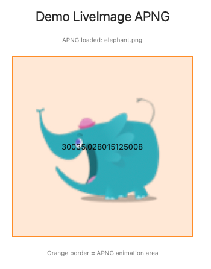
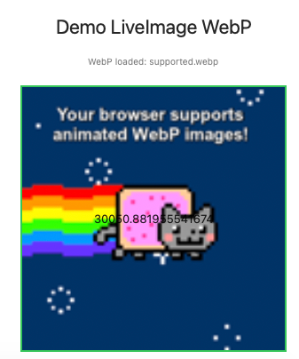

# LiveImage

LiveImage 是一个用于 SwiftUI 的高性能动图显示库，支持 GIF、APNG 和 WebP 格式。适用于 macOS 15+ 和 iOS 18+，基于 Swift 6 开发。该仓库还包含一个用于演示和测试的示例应用 [LiveImageDemo](#liveimagedemo)。

## 特性

- 支持 GIF、APNG、WebP 动图格式
- 原生 SwiftUI 组件，易于集成
- 高性能解码与渲染
- 支持 macOS 15+ 和 iOS 18+
- 现代 Swift 6 语法与最佳实践

## 安装

### Swift Package Manager

在 `Package.swift` 的 dependencies 添加：

```swift
.package(url: "https://github.com/wflixu/LiveImage.git", from: "1.0.0")
```

或在 Xcode 中通过 `File > Add Packages...` 搜索 `LiveImage` 并添加。

## 🚀 快速开始

### 安装依赖
```swift
// Package.swift
dependencies: [
    .package(url: "https://github.com/wflixu/LiveImage.git", from: "1.0.0")
]
```

### 基本使用

```swift
import LiveImage
import SwiftUI

struct ContentView: View {
    var body: some View {
        VStack {
            // GIF 动画
            if let gifUrl = Bundle.main.url(forResource: "animation", withExtension: "gif") {
                LiveImage(url: gifUrl)
                    .frame(width: 200, height: 200)
            }

            // APNG 动画
            if let apngUrl = Bundle.main.url(forResource: "animation", withExtension: "png") {
                LiveImage(url: apngUrl)
                    .frame(width: 300, height: 300)
            }

            // WebP 动画
            if let webpUrl = Bundle.main.url(forResource: "animation", withExtension: "webp") {
                LiveImage(url: webpUrl)
                    .frame(width: 250, height: 250)
            }
        }
    }
}
```

### 高级配置

```swift
import LiveImage
import SwiftUI

struct ContentView: View {
    @State private var isPlaying = true

    var body: some View {
        LiveImage(url: gifUrl)
            .frame(width: 200, height: 200)
            .onTapGesture {
                isPlaying.toggle()
            }
            .environment(\.animatedImageViewConfiguration, AnimatedImageViewConfiguration.performance)
    }
}
```

## 支持平台

- macOS 15 及以上
- iOS 18 及以上
- Swift 6.0 及以上

## 📸 LiveImageDemo - 完整演示应用

本仓库包含 `LiveImageDemo` 示例项目，方便测试和演示 LiveImage 的功能。你可以直接运行该项目体验库的实际效果。

### 🖼️ 运行截图展示

以下是 LiveImage 在不同格式动画下的实际运行效果：

#### 🎬 GIF 动画演示

- **格式**: 标准 GIF 格式，128x128 像素，2帧动画
- **效果**: 流畅的循环播放，经典的动图效果

#### 🎨 APNG 动画演示

- **格式**: APNG 动画格式，480x400 像素，34帧动画
- **效果**: 高质量的多帧动画，PNG 的无损压缩与透明度支持

#### 🌐 WebP 动画演示

- **格式**: WebP 动画格式，400x400 像素，12帧动画
- **效果**: 现代化的 Web 格式动画，优秀的压缩比与现代浏览器兼容

### ✨ 演示特性

LiveImageDemo 展示了以下核心功能：

| 特性 | 描述 | 状态 |
|------|------|------|
| 🎬 **多格式支持** | 同时支持 GIF、APNG、WebP 三种主流动画格式 | ✅ 完成 |
| ⚡ **高性能渲染** | 基于 CADisplayLink 的 60fps 流畅动画播放 | ✅ 完成 |
| 🎨 **SwiftUI 集成** | 原生 SwiftUI 组件，无缝集成到现代应用中 | ✅ 完成 |
| ⚙️ **可配置播放** | 支持自定义播放速度、循环次数等参数 | ✅ 完成 |
| 📱 **跨平台兼容** | 支持 macOS 15+ 和 iOS 18+ 平台 | ✅ 完成 |


## 🚀 运行 Demo

```bash
# 克隆仓库
git clone https://github.com/wflixu/LiveImage.git

# 进入项目
cd LiveImage

# 运行演示
swift run Demo
```

## 贡献

欢迎 issue 和 PR！请遵循 [贡献指南](CONTRIBUTING.md)（如有）。

## 开发与测试

- 当前开发环境：macOS 15.5，Swift 6.1.2
- 推荐使用 Xcode 15.4 及以上版本

## 📜 License

MIT License. 详见 [LICENSE](LICENSE) 文件。
